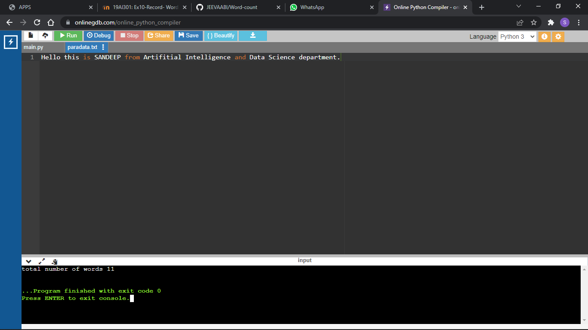

# Word-count
## AIM:
To write a python program for getting the word count from a text.
## EQUIPEMENT'S REQUIRED: 
PC
Anaconda - Python 3.7
## ALGORITHM: 
### Step 1:
creat a .txt file add sentence to it

### Step 2: 
using open() open the .txt file in read mode in python compiler
 
### Step 3: 
assign a variable for value zero

### Step 4:  
using the for loop assigning the fp then use variable to split the content

### Step 5: 
itrate in nested loop to increment the variable

### Step 6: 
print the variable

## PROGRAM:
```
with open('paradata.txt','r') as fp:
    count=0
    for word in fp:
        para=word.split()
        for i in para:
            count+=1
    print('total number of words',count)
```

### OUTPUT:



## RESULT:
Thus the program is written to find the word count from a text.
